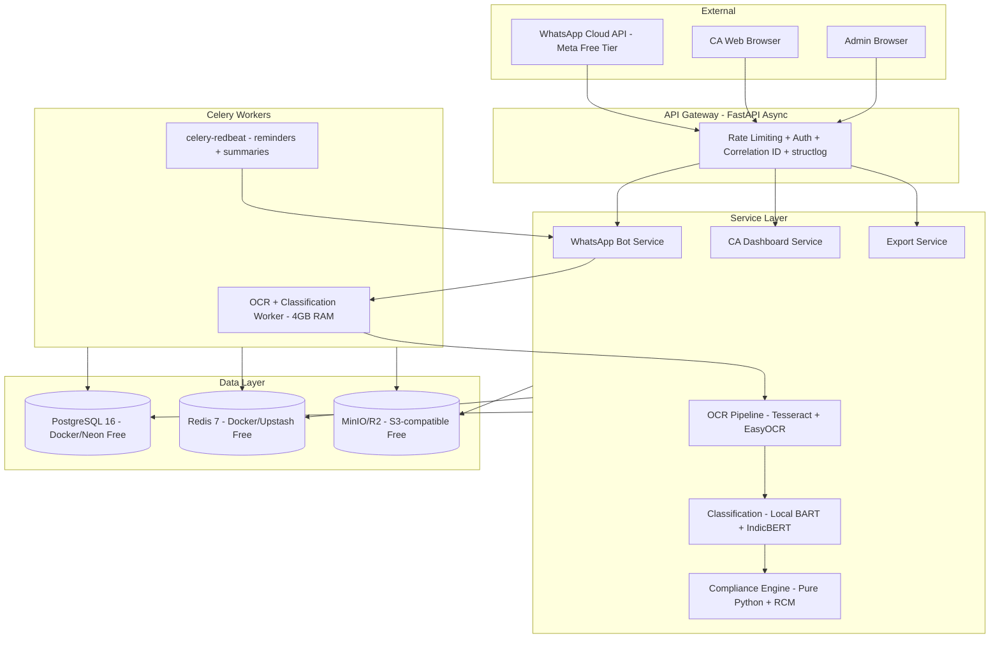
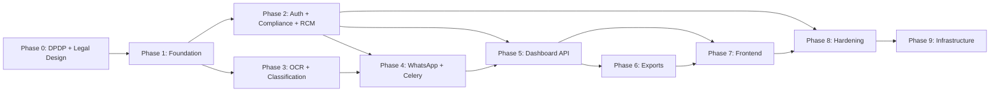

# VyapaarBandhu Production System - Implementation Plan v2

## Revision Notes from v1

This revision addresses 7 critical gaps identified in the senior review, plus a hard constraint change:

| # | Gap | Resolution |
|---|-----|------------|
| 1 | **DPDP Act 2023 not a prerequisite** | Added Phase 0 -- legal/consent model design before any code |
| 2 | **RCM missing from compliance engine** | Added to Phase 2 -- GTA, legal services, unregistered vendor rules |
| 3 | **OCR confidence thresholds are guesses** | Added labeled evaluation dataset task in Phase 3 before shipping |
| 4 | **Celery Beat SPOF** | Switched to `celery-redbeat` in Phase 4 (not deferred to Phase 8) |
| 5 | **Graceful shutdown gap** | `acks_late` + `task_reject_on_worker_lost` added to Phase 4 Celery config |
| 6 | **Audit trail not legally defensible** | Added SHA-256 hash chain on audit_log + immutable backup in Phase 2 |
| 7 | **Testing: line coverage is vanity** | Added mutation testing (mutmut) on compliance engine, empirical OCR threshold validation |
| 8 | **FREE-ONLY CONSTRAINT** | Replaced all paid services with free/open-source alternatives (see Technology Stack section) |

---

## 1. Revised Technology Stack (Free-Only)

The master prompt specifies Google Cloud Vision, AWS S3, RDS, ElastiCache, EKS, Sentry Cloud, and HuggingFace Inference API -- all paid. Here is the free-equivalent mapping:

| Master Prompt Spec | Free Replacement | Rationale |
|---|---|---|
| Google Cloud Vision API (paid) | **Tesseract 5** (primary) + **EasyOCR** (fallback) | Both are open-source, run locally, zero API cost |
| HuggingFace Inference API (rate-limited free tier) | **Local transformers inference** with `facebook/bart-large-mnli` + `meet136/indicbert-gst-classifier` downloaded locally | No API calls, no rate limits, no cost |
| AWS S3 | **MinIO** (self-hosted, S3-compatible) in Docker for dev; **Cloudflare R2** free tier (10GB storage, 1M reads/mo) for prod | Drop-in S3 replacement, zero cost at our scale |
| AWS RDS PostgreSQL | **PostgreSQL 16 in Docker** (dev) / **Neon** free tier or **Supabase** free tier (prod) | 0.5GB free on Neon, 500MB on Supabase |
| AWS ElastiCache Redis | **Redis 7 in Docker** (dev) / **Upstash** free tier (10K commands/day) for prod | Sufficient for session state + rate limiting at early scale |
| AWS EKS | **Docker Compose** (dev+staging) / **Railway** or **Render** free tier (prod) | K8s is overkill until 50+ CAs; Render has free web service tier |
| Sentry Cloud | **GlitchTip** (self-hosted, open-source Sentry alternative) or **Sentry self-hosted** in Docker | Full error tracking, zero cost |
| HashiCorp Vault | **Docker secrets** (dev) / **SOPS** with age encryption (prod) | Mozilla SOPS is free, battle-tested for secret management |
| Prometheus + Grafana Cloud | **Prometheus + Grafana** self-hosted in Docker Compose | Standard open-source observability stack |
| WeasyPrint | **WeasyPrint** (already free, open-source) | No change needed |
| OpenTelemetry | **OpenTelemetry** (already free, open-source) | No change needed |
| Meta WhatsApp Cloud API | **Meta WhatsApp Cloud API** (free for first 1,000 conversations/month) | Free tier is sufficient for early users |
| Vercel (frontend hosting) | **Vercel** free tier or **Cloudflare Pages** free tier | Next.js deploys for free on Vercel |

### Local ML Inference Setup

Since we cannot rely on paid HuggingFace Inference API calls, the classification pipeline runs models locally:

```
# Models downloaded once at container build time
facebook/bart-large-mnli          ~1.6GB  (zero-shot classification)
meet136/indicbert-gst-classifier  ~440MB  (fine-tuned GST classifier)

# Runtime: transformers + torch (CPU inference)
# Celery worker handles inference off the API hot path
# Cold start ~15s on first request, then cached in memory
```

This requires the Celery worker container to have ~4GB RAM for model loading. CPU inference is acceptable because OCR processing is already async via Celery.

---

## 2. Gap Analysis: Current State vs Master Prompt

### Current Codebase Summary

| Component | Current State | Target State | Gap |
|---|---|---|---|
| **Database** | Sync SQLAlchemy, Integer PKs, 8 simple tables | Async SQLAlchemy 2.0, UUID PKs, `vyapaar` schema, RLS, audit log | **Critical** |
| **API Framework** | FastAPI sync, no middleware, CORS `*` | FastAPI async, correlation IDs, structured logging, rate limiting | **Critical** |
| **Auth** | HS256 JWT, 30-day expiry, no refresh tokens | RS256 JWT, 15min access + 7d refresh rotation, httpOnly cookies | **Critical** |
| **WhatsApp** | Twilio sandbox, background threads, in-memory state | Meta Cloud API, Redis state machine, Celery tasks | **Critical** |
| **OCR** | OpenRouter VLM single provider | Tesseract 5 primary + EasyOCR fallback, confidence scoring | **High** |
| **Classification** | 3-layer pipeline exists -- keyword+BART+IndicBERT | Same 3-layer, local inference, 7 canonical categories | **Medium** |
| **Compliance** | Basic ITC blocked list, no exceptions, Float math | Decimal math, Sec 17(5) exceptions, RCM, composition, anomaly | **High** |
| **GSTIN Validator** | Modulo 36 checksum + OCR correction | Same approach -- minor interface refactor | **Low** |
| **Frontend** | React+Vite, single JSX, mock data, inline styles | Next.js 15 App Router, TypeScript, Tailwind+shadcn/ui | **Critical** |
| **Exports** | ReportLab PDF, basic GSTR-3B JSON | WeasyPrint PDF with CA branding, GSTN-format JSON, Tally stub | **High** |
| **Task Queue** | APScheduler + background threads | Celery 5 + celery-redbeat + Redis broker | **High** |
| **Testing** | Zero tests | 85%+ coverage, mutation testing on compliance, empirical OCR thresholds | **Critical** |
| **DPDP Compliance** | Nothing | Consent model, purpose limitation, DPO record, breach SLA | **Critical** |
| **RCM** | Nothing | Reverse charge for GTA, legal, unregistered vendors | **High** |

### What Gets Salvaged

- [`gstin_validator.py`](backend/app/services/gstin_validator.py) -- Modulo 36 logic is correct; needs interface refactor
- [`classification_service.py`](backend/app/services/classification_service.py) -- 3-layer structure sound; adapt to local inference + new categories
- [`compliance_engine.py`](backend/app/services/compliance_engine.py) -- Skeleton reusable; needs Decimal, Sec 17(5) exceptions, RCM
- Keyword rules from [`classification_service.py`](backend/app/services/classification_service.py:165) -- 400+ rules already built

---

## 3. Clarifying Decisions (All 8 Resolved)

| # | Decision |
|---|----------|
| Q1 | Monthly filing only for v1 -- no `filing_frequency` field |
| Q2 | One phone = one client + CA manual override UI escape hatch |
| Q3 | Self-serve + `is_verified` flag + ICAI certificate image upload gate |
| Q4 | Bank PDF parser scoped to GSTR-2B reconciliation, CA dashboard only, feature-flagged |
| Q5 | TallyPrime export stub built now with `NotImplementedError` |
| Q6 | GSTN verification stub built now returning `{verified: null}` |
| Q7 | Logo: PNG/JPG/SVG max 2MB, auto-generate 200x200 thumbnail |
| Q8 | Images 3yr, extracted data 7yr, nightly hard-delete cron |

---

## 4. Architecture Overview



---

## 5. Phased Implementation Plan

### Phase 0: Legal and Consent Model Design (No Code)

**Goal**: DPDP Act 2023 compliance is a prerequisite, not a hardening item. Design the consent model, data flows, and legal basis before writing a single line of async SQLAlchemy.

- [ ] **0.1** Define lawful processing basis under DPDP Act 2023 Section 4 -- "consent" for invoice data processing, "legitimate use" for CA professional obligation
- [ ] **0.2** Design consent artifact schema -- what the business owner consents to when their CA onboards them via WhatsApp:
  - Data collected: phone number, GSTIN, invoice images, financial amounts
  - Purpose: GST filing draft preparation for their CA
  - Retention: images 3yr, data 7yr
  - Rights: access, correction, erasure (within retention limits)
- [ ] **0.3** Design the WhatsApp consent flow -- first message from bot after CA onboards a client must collect explicit consent before any invoice processing
- [ ] **0.4** Add to database schema: `consent_given_at TIMESTAMPTZ`, `consent_version TEXT`, `consent_ip INET` on `vyapaar.clients` table
- [ ] **0.5** Define Data Protection Officer record and breach notification SLA (72 hours) -- document in `DPDP_COMPLIANCE.md`
- [ ] **0.6** Design CA onboarding workflow with ICAI certificate upload gate -- flow diagram for verification

### Phase 1: Foundation -- Repository Structure + Database + Core Config

**Goal**: Correct project skeleton, database schema with DPDP consent fields, and configuration.

- [ ] **1.1** Create directory structure per master prompt Part 4 -- move/rename existing files
- [ ] **1.2** Set up [`config.py`](backend/app/config.py) with Pydantic Settings -- all env vars from Part 19, adapted for free-tier services (MinIO endpoint, local model paths)
- [ ] **1.3** Set up async SQLAlchemy 2.0 session factory in [`db/session.py`](backend/app/db/session.py) replacing sync [`database.py`](backend/app/core/database.py)
- [ ] **1.4** Create all SQLAlchemy ORM models with UUID PKs matching Part 3 schema + Phase 0 consent fields:
  - [`ca_account.py`](backend/app/models/ca_account.py) -- `icai_certificate_s3_key`, `is_verified`
  - [`client.py`](backend/app/models/client.py) -- `consent_given_at`, `consent_version`
  - [`invoice.py`](backend/app/models/invoice.py) -- full schema with dedup_hash, confidence, status enum, RCM fields
  - [`monthly_summary.py`](backend/app/models/monthly_summary.py)
  - [`audit_log.py`](backend/app/models/audit_log.py) -- with `prev_hash TEXT` for hash chain
  - [`reminder_log.py`](backend/app/models/reminder_log.py)
  - [`refresh_token.py`](backend/app/models/refresh_token.py)
  - [`classification_feedback.py`](backend/app/models/classification_feedback.py)
- [ ] **1.5** Initialize Alembic with initial migration
- [ ] **1.6** Create FastAPI app factory with middleware: correlation ID, structlog JSON logging, CORS with explicit origins (no `*`)
- [ ] **1.7** Set up [`dependencies.py`](backend/app/dependencies.py) -- async DB session, current CA dependency
- [ ] **1.8** Create [`docker-compose.yml`](docker-compose.yml):
  - PostgreSQL 16
  - Redis 7
  - MinIO (S3-compatible object storage)
  - FastAPI backend
  - Celery worker (4GB RAM for local ML models)
  - Celery beat (celery-redbeat)
  - GlitchTip (error tracking)
  - Prometheus + Grafana
- [ ] **1.9** Create `.env.example` with all required env vars
- [ ] **1.10** Add utility modules: [`audit.py`](backend/app/utils/audit.py) (with SHA-256 hash chain), [`crypto.py`](backend/app/utils/crypto.py), [`dedup.py`](backend/app/utils/dedup.py), [`phone.py`](backend/app/utils/phone.py)

### Phase 2: Auth + Compliance Engine + RCM + Audit Hash Chain

**Goal**: Production-grade auth, the compliance engine with RCM support, and a legally-defensible audit trail.

#### Auth
- [ ] **2.1** Implement RS256 JWT auth:
  - RSA key pair generation (free, openssl)
  - Registration with bcrypt (12 rounds), password policy (12+ chars)
  - Login: access token (15min) + refresh token in httpOnly Secure SameSite=Strict cookie (7d)
  - Refresh rotation: revoke old, issue new
  - Logout: revoke refresh token
  - Rate limiting: 5/min login, 3/hr register (Redis counters)

#### Compliance Engine (Pure Python, No AI)
- [ ] **2.2** Refactor [`engine.py`](backend/app/services/compliance/engine.py) with Decimal math:
  - `evaluate_invoice_itc()` -- composition check (Sec 10(4)), Sec 17(5), capital goods flag, interstate detection
  - Every function references specific GST Act section in docstring
- [ ] **2.3** Implement [`blocked_categories.py`](backend/app/services/compliance/blocked_categories.py):
  - `ALWAYS_BLOCKED` set
  - `BLOCKED_WITH_EXCEPTIONS` dict (motor vehicles for dealers, food for restaurants, health for hospitals)
  - `is_section_17_5_blocked()` with `can_ca_override` flag
- [ ] **2.4** Implement [`itc_calculator.py`](backend/app/services/compliance/itc_calculator.py) -- Decimal with `ROUND_HALF_UP`
- [ ] **2.5** Implement [`gstin_state_mapper.py`](backend/app/services/compliance/gstin_state_mapper.py) -- `is_interstate_transaction()` from GSTIN first 2 digits
- [ ] **2.6** **NEW: Implement RCM (Reverse Charge Mechanism)**:
  - Add `is_rcm BOOLEAN DEFAULT FALSE` and `rcm_category TEXT` to invoice model
  - RCM applies to: GTA services, legal services, security services, import of services, purchases from unregistered vendors above Rs.5000/day
  - `evaluate_rcm_liability()` -- buyer must pay GST directly to government
  - RCM ITC is claimable only after tax is paid -- flag for CA confirmation
  - Include RCM liability in GSTR-3B JSON output (Table 3.1(d))
- [ ] **2.7** Implement [`deadline_calculator.py`](backend/app/services/compliance/deadline_calculator.py) -- GSTR-1 (11th), GSTR-3B (20th)
- [ ] **2.8** Implement [`anomaly_detector.py`](backend/app/services/compliance/anomaly_detector.py) -- 2.5x 3-month average
- [ ] **2.9** Implement [`gst_rates.py`](backend/app/services/compliance/gst_rates.py) -- versioned rate table in YAML/JSON config, not hardcoded

#### Audit Hash Chain
- [ ] **2.10** Implement cryptographic hash chain on `vyapaar.audit_log`:
  - Each row stores `prev_hash = SHA256(prev_row_id + prev_hash + event_data_json)`
  - First row uses a genesis hash
  - `verify_audit_chain()` function that walks the chain and validates integrity
  - Nightly export of chain root hash to MinIO/R2 with immutable retention policy
- [ ] **2.11** Refactor [`gstin_validator.py`](backend/app/services/ocr/gstin_validator.py) -- adapt existing Modulo 36 to `GSTINValidationResult` dataclass

#### S3-Compatible Storage
- [ ] **2.12** Implement [`s3_client.py`](backend/app/services/storage/s3_client.py) -- MinIO/R2 compatible: upload, download, presigned URLs (15min), thumbnail generation for CA logos
- [ ] **2.13** Client management CRUD in [`clients.py`](backend/app/api/v1/clients.py) -- CA-scoped, consent check before any data processing

#### Tests
- [ ] **2.14** Write exhaustive tests for compliance engine -- **100% line coverage + mutation testing with mutmut**:
  - `test_compliance_engine.py` -- composition, Sec 17(5) with exceptions, RCM
  - `test_gstin_validator.py` -- valid, corrected, ambiguous, invalid
  - `test_itc_calculator.py` -- Decimal precision, interstate vs intrastate
  - `test_anomaly_detector.py` -- below/above threshold, no history
  - `test_dedup.py` -- hash collision resistance
  - `test_rcm.py` -- GTA, legal, unregistered vendor, import of services
  - `test_audit_hash_chain.py` -- chain integrity, tamper detection

### Phase 3: OCR + Classification Pipeline (Free Local Inference)

**Goal**: Replace OpenRouter VLM with free local OCR and classification. Build empirical evaluation before shipping.

#### OCR Pipeline
- [ ] **3.1** Implement [`tesseract.py`](backend/app/services/ocr/tesseract.py) -- Tesseract 5 as **primary** OCR (free, open-source, via pytesseract)
- [ ] **3.2** Implement [`easyocr_adapter.py`](backend/app/services/ocr/easyocr_adapter.py) -- EasyOCR as **fallback** (free, supports Hindi+English, GPU optional)
- [ ] **3.3** Implement [`field_extractor.py`](backend/app/services/ocr/field_extractor.py) -- regex + heuristics for 9 fields from raw OCR text
- [ ] **3.4** Implement [`pipeline.py`](backend/app/services/ocr/pipeline.py) -- orchestrator:
  - Tesseract primary (confidence threshold TBD by evaluation)
  - EasyOCR fallback if Tesseract confidence below threshold
  - GSTIN validation + auto-correction
  - Confidence classification (thresholds set by evaluation in 3.7)
- [ ] **3.5** Port [`image_processor.py`](backend/app/services/image_processor.py) -- keep existing OpenCV preprocessing (CLAHE, denoise, deskew, threshold)

#### Classification Pipeline (Local Models)
- [ ] **3.6** Set up local model loading in Celery worker:
  - Download `facebook/bart-large-mnli` and `meet136/indicbert-gst-classifier` at Docker build time
  - Load into memory on worker startup, cache across tasks
  - CPU inference (no GPU required, ~2-5s per classification)
- [ ] **3.7** Update [`categories.py`](backend/app/services/classification/categories.py) -- 7 canonical categories with RCM-relevant additions
- [ ] **3.8** Refactor [`keyword_rules.py`](backend/app/services/classification/keyword_rules.py) -- port existing 400+ rules to new category mapping
- [ ] **3.9** Implement local [`bart_classifier.py`](backend/app/services/classification/bart_classifier.py) -- `transformers.pipeline("zero-shot-classification")` running locally
- [ ] **3.10** Implement local [`indicbert_classifier.py`](backend/app/services/classification/indicbert_classifier.py) -- `transformers.pipeline("text-classification")` running locally
- [ ] **3.11** Implement [`classification/pipeline.py`](backend/app/services/classification/pipeline.py) -- 3-layer with fallthrough

#### Empirical Threshold Validation (Before Shipping)
- [ ] **3.12** **Build labeled evaluation dataset**: Collect 200+ real Indian GST invoice images, manually label all 9 fields + correct category
- [ ] **3.13** **Run OCR evaluation**: Measure Tesseract vs EasyOCR precision/recall on the labeled set. Set confidence thresholds from actual P/R curves, not guesses
- [ ] **3.14** **Run classification evaluation**: Measure keyword/BART/IndicBERT accuracy on labeled descriptions. Set layer fallthrough thresholds from actual data
- [ ] **3.15** Document threshold decisions in `OCR_EVALUATION.md` with charts

### Phase 4: WhatsApp Bot -- Meta Cloud API + Celery + Redis State Machine

**Goal**: Replace Twilio with Meta Cloud API (free tier), add Redis state machine, Celery tasks with production-grade reliability.

- [ ] **4.1** Implement [`whatsapp/client.py`](backend/app/services/whatsapp/client.py) -- Meta WhatsApp Cloud API (free 1,000 conversations/month): send text, download media
- [ ] **4.2** Implement webhook HMAC-SHA256 verification middleware (Part 9.3)
- [ ] **4.3** Implement webhook handler in [`webhooks.py`](backend/app/api/v1/webhooks.py) -- GET verification challenge + POST inbound messages
- [ ] **4.4** Implement [`message_router.py`](backend/app/services/whatsapp/message_router.py) -- idempotency via `whatsapp_message_id`, client lookup, **consent check before first invoice processing**
- [ ] **4.5** Implement Redis-backed conversation state machine -- `wa_session:{phone}`, TTL 2hr, states: `IDLE -> CONSENT_PENDING -> PROCESSING_IMAGE -> AWAITING_CONFIRMATION -> CONFIRMED`
  - New state: `CONSENT_PENDING` -- first interaction requires explicit consent before any data processing (DPDP Act)
- [ ] **4.6** Implement [`invoice_flow.py`](backend/app/services/whatsapp/invoice_flow.py) + [`confirmation_flow.py`](backend/app/services/whatsapp/confirmation_flow.py) -- Hinglish templates from Part 5.2
- [ ] **4.7** Implement [`reminder_service.py`](backend/app/services/whatsapp/reminder_service.py) -- check `reminder_log` for idempotency

#### Celery with Production Reliability
- [ ] **4.8** Set up Celery in [`tasks/celery_app.py`](backend/app/tasks/celery_app.py):
  - Redis broker
  - **`celery-redbeat`** as beat scheduler (replaces default file-based scheduler -- no SPOF)
  - **`acks_late=True`** globally -- acknowledge only after successful processing
  - **`task_reject_on_worker_lost=True`** globally -- requeue if worker dies mid-task
  - Graceful shutdown: `CELERY_WORKER_TERM_HARD_TIMEOUT=30` for K8s rolling deploys
- [ ] **4.9** Implement [`tasks/ocr_task.py`](backend/app/tasks/ocr_task.py) -- 3 retries, exponential backoff, 90s hard limit
- [ ] **4.10** Implement [`tasks/reminder_task.py`](backend/app/tasks/reminder_task.py) -- daily 9 AM IST via celery-redbeat
- [ ] **4.11** Implement [`tasks/summary_task.py`](backend/app/tasks/summary_task.py) -- nightly summary recalculation
- [ ] **4.12** Write integration tests: `test_invoice_flow.py`

### Phase 5: CA Dashboard API

**Goal**: Complete REST API for the CA dashboard.

- [ ] **5.1** API v1 router in [`api/v1/router.py`](backend/app/api/v1/router.py)
- [ ] **5.2** `GET /dashboard/overview` -- traffic light summary (green/yellow/red logic from Part 10.2)
- [ ] **5.3** Invoice endpoints: list (filterable), detail, approve, reject, override
  - Override logs to `classification_feedback` table for retraining pipeline
  - Every approve/reject/override writes to audit_log with hash chain
- [ ] **5.4** Export endpoints: PDF, GSTR-3B JSON (with RCM section), Tally stub (501)
- [ ] **5.5** Admin endpoints: stats, CA accounts, audit log viewer with chain verification status
- [ ] **5.6** Pydantic v2 schemas in [`schemas/`](backend/app/schemas/)
- [ ] **5.7** Integration tests: `test_ca_dashboard_api.py`, `test_exports.py`

### Phase 6: Export Generators

- [ ] **6.1** [`pdf_generator.py`](backend/app/services/exports/pdf_generator.py) -- WeasyPrint + Jinja2 template (Part 11.1), CA logo, pending-notice, disclaimer, RCM section
- [ ] **6.2** [`gstr3b_json.py`](backend/app/services/exports/gstr3b_json.py) -- GSTN format with RCM in Table 3.1(d), only CA-confirmed figures
- [ ] **6.3** [`tally_xml.py`](backend/app/services/exports/tally_xml.py) stub -- `NotImplementedError`
- [ ] **6.4** GSTN verification stub -- `verify_invoice()` returns `{verified: null, source: "pending_integration"}`

### Phase 7: CA Dashboard Frontend -- Next.js 15

**Goal**: Replace React+Vite prototype with Next.js 15 + TypeScript + Tailwind + shadcn/ui. Deploy on Vercel free tier.

- [ ] **7.1** Initialize Next.js 15 with App Router, TypeScript strict, Tailwind CSS 3, shadcn/ui
- [ ] **7.2** Typed API client [`lib/api.ts`](frontend/src/lib/api.ts) -- axios, automatic refresh
- [ ] **7.3** Auth handling [`lib/auth.ts`](frontend/src/lib/auth.ts) -- access token in memory only, refresh via httpOnly cookie
- [ ] **7.4** TypeScript interfaces in [`types/index.ts`](frontend/src/types/index.ts)
- [ ] **7.5** Auth pages: login, register (with ICAI certificate upload)
- [ ] **7.6** Dashboard layout with sidebar
- [ ] **7.7** Dashboard overview: traffic light grid, ITC cards, deadline countdowns
- [ ] **7.8** Client pages: list + add + detail with consent status indicator
- [ ] **7.9** Invoice detail: OCR confidence badge, RCM indicator, approve/override/reject panel
- [ ] **7.10** Exports page: PDF + GSTR-3B JSON download per client per period
- [ ] **7.11** Settings: firm profile, logo upload, ICAI certificate
- [ ] **7.12** Reusable components: `InvoiceCard`, `ClientStatusBadge`, `OCRConfidenceBadge`, `ApproveOverridePanel`, `DeadlineCountdown`, `RCMBadge`, `ConsentStatusBadge`

### Phase 8: Production Hardening

- [ ] **8.1** Full test suite: 85%+ overall, 100% compliance (line + mutation with mutmut)
- [ ] **8.2** Replace all `print()` with structlog JSON -- PII masking throughout
- [ ] **8.3** GlitchTip (self-hosted Sentry alternative) integration
- [ ] **8.4** OpenTelemetry -> self-hosted Prometheus + Grafana dashboards (Part 13.2 metrics)
- [ ] **8.5** Rate limiting middleware via Redis (Part 9.1 limits)
- [ ] **8.6** Security audit: Pydantic validation, MIME check, no `dangerouslySetInnerHTML`, no SSRF, parameterised SQL only
- [ ] **8.7** Dockerfiles: backend (multi-stage, includes Tesseract 5 + model downloads), frontend
- [ ] **8.8** GitHub Actions CI: pytest + coverage + mypy + ruff + bandit + mutmut on compliance
- [ ] **8.9** Data retention cron: soft-delete + nightly hard-delete (images 3yr, data 7yr)
- [ ] **8.10** E2E test: `test_full_whatsapp_to_pdf.py`

### Phase 9: Infrastructure (Free-Tier Production)

- [ ] **9.1** Production `docker-compose.prod.yml` for single-server deployment:
  - PostgreSQL 16 with daily pg_dump backup to R2
  - Redis 7 with RDB persistence
  - MinIO with bucket policies
  - Nginx reverse proxy with Let's Encrypt TLS (free)
  - Backend + Celery worker + celery-redbeat
  - GlitchTip + Prometheus + Grafana
- [ ] **9.2** Alternative: Deploy to free tiers:
  - Backend: Render free tier (750 hrs/month)
  - Frontend: Vercel free tier
  - Database: Neon free tier (0.5GB)
  - Redis: Upstash free tier (10K commands/day)
  - Object storage: Cloudflare R2 free tier (10GB)
- [ ] **9.3** GitHub Actions CD: build Docker images, push to GHCR (free), deploy
- [ ] **9.4** DPDP compliance documentation: `DPDP_COMPLIANCE.md`, `PRIVACY_POLICY.md`, `DATA_RETENTION_POLICY.md`

---

## 6. Dependency Graph



Phase 0 is a prerequisite to everything. Phases 2 and 3 can run in parallel after Phase 1. Phase 4 depends on both 2 and 3. Phases 5-7 are sequential. Phase 8 wraps it all. Phase 9 is deployment.

---

## 7. Risk Register

| Risk | Impact | Mitigation |
|---|---|---|
| **DPDP enforcement before launch** | Platform shutdown | Phase 0 consent model + legal documentation |
| **RCM miscalculation** | CA cannot certify GSTR-3B | 100% test coverage + mutation testing + CA override gate |
| **Tesseract OCR quality on Indian invoices** | Poor field extraction | EasyOCR fallback + empirical evaluation dataset + OpenCV preprocessing |
| **Local ML model memory requirements** | Celery worker OOM | Model quantization (INT8), lazy loading, 4GB RAM allocation |
| **Meta WhatsApp API approval delay** | Blocks Phase 4 | Build against sandbox; test number available immediately |
| **Free-tier database limits (500MB Neon)** | Storage exhaustion | MinIO for images (not DB), aggressive data lifecycle |
| **Celery-redbeat Redis dependency** | Beat scheduler failure | Redis persistence (RDB+AOF), Upstash with replication |
| **Audit hash chain performance** | Slow inserts | Batch hash computation, async chain verification |
| **Frontend rewrite scope** | Timeline risk | Start with login + dashboard overview + invoice list; defer settings |

---

## 8. Free-Only Cost Summary

| Service | Free Tier Limit | Our Expected Usage |
|---|---|---|
| Meta WhatsApp Cloud API | 1,000 conversations/month | Sufficient for first 50 clients |
| Neon PostgreSQL | 0.5GB storage, 190 compute hours | Sufficient for first 6 months |
| Upstash Redis | 10K commands/day | Sufficient for sessions + rate limiting |
| Cloudflare R2 | 10GB storage, 1M reads/month | Sufficient for ~3,000 invoice images |
| Vercel | 100GB bandwidth, serverless functions | Sufficient for CA dashboard |
| Render | 750 hours/month free web service | Sufficient for backend API |
| GitHub Actions | 2,000 minutes/month | Sufficient for CI/CD |
| GHCR (Container Registry) | Unlimited for public repos | Free Docker image storage |
| Let's Encrypt | Unlimited free TLS certs | Production HTTPS |
| **Total monthly cost** | **$0** | Until free-tier limits exceeded |
